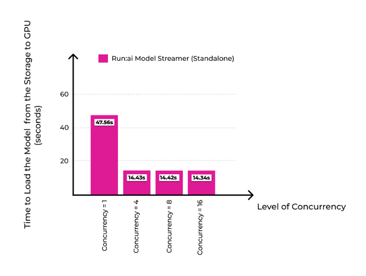
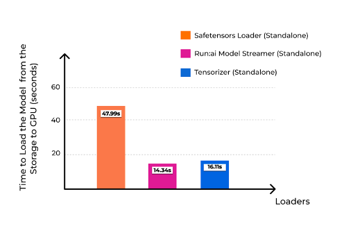
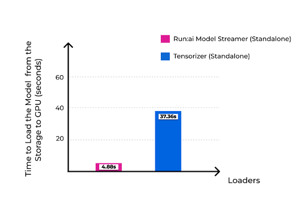

# Run:ai Model Streamer Benchmarks

## Technical Configuration

The experiments were conducted using the following setup:

### Model
- **Meta-Llama-3-8B**, a large-scale language model weighing 15 GB, stored in a single Safetensors format.

### Hardware
- **AWS g5.12xlarge** instance featuring 4 NVIDIA A10G GPUs (only one GPU was used for all tests to maintain consistency).

### Software Stack
- **CUDA 12.4**
- **vLLM 0.5.5** (Transformers 4.44.2)
- **Run:ai Model Streamer 0.6.0**
- **Tensorizer 2.9.0**
- **Transformers 4.45.0.dev0**
- **Accelerate 0.34.2**

For the experiments involving Tensorizer, the same model was serialized into **Tensorizer’s proprietary tensor format** using the recipe provided by the Tensorizer framework.

### Storage Types
To assess the loaders' performance under different storage conditions, we conducted experiments using three distinct storage configurations:

#### Local SSDs (GP3 and IO2 SSDs)
High-performance local storage types with different IOPS and throughput limits:

##### **GP3 SSD**
- **Capacity**: 750 GB
- **IOPS**: 16,000
- **Throughput**: 1,000 MiB/s

##### **IO2 SSD**
- **Capacity**: 500 GB
- **IOPS**: 100,000
- **Throughput**: up to 4,000 MiB/s

##### Amazon S3
A cloud-based storage option where the latency and bandwidth constraints of the cloud environment were expected to affect performance. We used S3 buckets located in the same AWS region as the instance to minimize inter-region latency.

## Experiment Design

The experiments were structured to compare the performance of different model loaders (Run:ai Model Streamer, Tensorizer, and HuggingFace Safetensors Loader) across the three storage types:

#### Experiment #1: GP3 SSD
We measured model loading times using different loaders on the GP3 SSD configuration.  
*(Results as Tables in Appendix A)*

#### Experiment #2: IO2 SSD
The same loaders were tested on IO2 SSD to evaluate the impact of higher IOPS and throughput.  
*(Results as Tables in Appendix B)*

#### Experiment #3: Amazon S3
This experiment focused on comparing loaders in a cloud storage scenario. Safetensors Loader was excluded as it does not support S3.  
*(Results as Tables in Appendix C)*

#### Experiment #4: vLLM with Different Loaders
We integrated Run:ai Model Streamer** into vLLM to measure the complete time required to load the model for all the storage types above and make it ready for inference. We compared it with the default loader of vLLM (HF Safetensors Loader) and Tensorizer integration of vLLM.  
Due to the fact that Safetensors loader does not support loading from S3, it was left out for the S3 experiments.  
This experiment allowed us to test the overall impact of the loaders on end-to-end model serving times.  
*(Results as Tables in Appendix D)*

**Each experiment was conducted under cold-start conditions to ensure consistency and eliminate the effects of cached data** For the cloud-based Amazon S3 tests, at least a two-minute wait between tests was introduced to avoid any caching effects on the AWS side and maintain accuracy in the results.

Specifically for Tensorizer experiments, we serialized the same model following the Tensorizer recipe to the required tensor format. For the benchmarking experiments for standalone Tensorizer, the benchmarking recipe in their repository was utilized.  
We performed these experiments without the optional hashing.

## Experiment Results
### Experiment #1: GP3 SSD 

**Figure 1:** The Effect of Concurrency on Model Loading Performance with Run:ai Model Streamer on GP3 SSD. This figure shows the impact of different concurrency levels (1, 4, 8, and 16) on model loading time using the Run:ai Model Streamer. As concurrency increases, load times decrease significantly, dropping from 47.56 seconds (at concurrency 1) to 14.34 seconds (at concurrency 16). At this point, the streamer achieves the maximum possible throughput of 1 GiB/s, which is the limit of the GP3 SSD.

**Figure 2:** Model Loading Performance on AWS GP3 SSD with Safetensors Loader, Run:ai Model Streamer, and Tensorizer. This figure compares the model loading times of Safetensors Loader, Run:ai Model Streamer, and Tensorizer on AWS GP3 SSD. The best observed performance for each loader is shown. For the Run:ai Model Streamer, the optimal result was achieved with a concurrency level of 16. For Tensorizer, the best performance was recorded using 16 workers as well.

### Experiment #2: IO2 SSD 

**Figure 3:** The Effect of Concurrency on Model Loading Performance with Run:ai Model Streamer on IO2 SSD. This figure shows the impact of different concurrency levels (1, 4, 8, and 16) on model loading time using the Run:ai Model Streamer. As concurrency increases, load times decrease significantly, dropping from 43.71 seconds (at concurrency 1) to 7.53 seconds (at concurrency 8).

**Figure 4:** Model Loading Performance on AWS IO2 SSD with Safetensors Loader, Run:ai Model Streamer, and Tensorizer. This figure compares the model loading times of Safetensors Loader, Run:ai Model Streamer, and Tensorizer on AWS IO2 SSD. The best observed performance for each loader is shown. For the Run:ai Model Streamer, the optimal result was achFigieved with a concurrency level of 8. For Tensorizer, the best performance is recorded using 8 workers as well (see Appendix B). 

### Experiment #3: S3 Bucket

**Figure 5:** The Effect of Concurrency on Model Loading Performance with Run:ai Model Streamer on S3 Bucket. This figure shows the impact of different concurrency levels (4, 16, 32 and 64) on model loading time using the Run:ai Model Streamer. As concurrency increases, load times decrease significantly, dropping from 28.24 seconds (at concurrency 4) to 4.88 seconds (at concurrency 32). 

**Figure 6:** Model Loading Performance from AWS S3 with Run:ai Model Streamer, and Tensorizer. This figure compares the model loading times of Run:ai Model Streamer and Tensorizer from S3 bucket. The best observed performance for each loader is shown. For the Run:ai Model Streamer, the optimal result was achieved with a concurrency level of 32 (4.88 seconds), while for Tensorizer, the best performance was recorded using 16 workers (37.36 seconds). 

### Experiment #4: vLLM with All Loaders

**Figure 7:** This figure presents the total time required for the vLLM engine to be ready for inference across different storage types (GP3 SSD, IO2 SSD, and S3) when using Run:ai Model Streamer, HuggingFace Safetensors Loader, and Tensorizer. The dark-colored bars show the time it takes to load the model from storage to GPU while the light-colored bars show the total time for the vLLM engine to load and get ready to serve requests (time to load the model plus the time to warm the inference engine up). For local storage options (GP3 and IO2 SSD), the Run:ai Model Streamer and Tensorizer consistently outperformed the Safetensors Loader, cutting readiness times nearly in half. On S3, both Run:ai Model Streamer and Tensorizer were tested, with Run:ai Model Streamer delivering significantly faster readiness times. 

## Appendix A
**Experiment #1: GP3 SSD Results as Table**

<table>
  <tr>
    <td><b>Run:ai Model Streamer</b></td>
    <td colspan="2"><b>HuggingFace Safetensors Loader</b></td>
  </tr>
  <tr>
    <td>Concurrency</td>
    <td><b>Time to Load the Model to GPU(s)</b></td>
    <td><b>Time to Load the Model to GPU(s)</b></td>
  </tr>
  <tr>
    <td>1</td>
    <td>47.56</td>
    <td rowspan="4">47.99</td>
  </tr>
  <tr>
    <td>4</td>
    <td>14.43</td>
  </tr>
  <tr>
    <td>8</td>
    <td>14.42</td>
  </tr>
  <tr>
    <td>16</td>
    <td>14.34</td>
  </tr>
</table>

<table>
  <tr>
    <th colspan="2"><b>Tensorizer</b></th>
  </tr>
  <tr>
    <th><b>Number of Readers</b></th>
    <th><b>Time to Load the Model to GPU(s)</b></th>
  </tr>
  <tr>
    <td>1</td>
    <td>50.74</td>
  </tr>
  <tr>
    <td>4</td>
    <td>17.38</td>
  </tr>
  <tr>
    <td>8</td>
    <td>16.49</td>
  </tr>
  <tr>
    <td>16</td>
    <td>16.11</td>
  </tr>
  <tr>
    <td>32</td>
    <td>17.18</td>
  </tr>
  <tr>
    <td>64</td>
    <td>16.44</td>
  </tr>
  <tr>
    <td>100</td>
    <td>16.81</td>
  </tr>
</table>

## Appendix B
**Experiment #2: IO2 SSD Results as Table**
<table>
  <tr>
    <td><b>Run:ai Model Streamer</b></td>
    <td colspan="2"><b>HuggingFace Safetensors Loader</b></td>
  </tr>
  <tr>
    <td>Concurrency</td>
    <td><b>Time to Load the Model to GPU(s)</b></td>
    <td><b>Time to Load the Model to GPU(s)</b></td>
  </tr>
  <tr>
    <td>1</td>
    <td>43.71</td>
    <td rowspan="5">47</td>
  </tr>
  <tr>
    <td>4</td>
    <td>11.19</td>
  </tr>
  <tr>
    <td>8</td>
    <td>7.53</td>
  </tr>
  <tr>
    <td>16</td>
    <td>7.61</td>
  </tr>
  <tr>
    <td>20</td>
    <td>7.62</td>
  </tr>
</table>

<table>
  <tr>
    <th colspan="2"><b>Tensorizer</b></th>
  </tr>
  <tr>
    <th><b>Number of Readers</b></th>
    <th><b>Time to Load the Model to GPU(s)</b></th>
  </tr>
  <tr>
    <td>1</td>
    <td>43.85</td>
  </tr>
  <tr>
    <td>4</td>
    <td>14.44</td>
  </tr>
  <tr>
    <td>8</td>
    <td>10.36</td>
  </tr>
  <tr>
    <td>16</td>
    <td>10.61</td>
  </tr>
  <tr>
    <td>32</td>
    <td>10.95</td>
  </tr>
</table>

## Appendix C
**Experiment #3: S3 Bucket Results as Table**

<table>
  <tr>
    <th colspan="2"><b>Run:ai Model Streamer</b></th>
  </tr>
  <tr>
    <th><b>Concurrency</b></th>
    <th><b>Time to Load the Model to GPU(s)</b></th>
  </tr>
  <tr>
    <td>4</td>
    <td>28.24</td>
  </tr>
  <tr>
    <td>16</td>
    <td>8.45</td>
  </tr>
  <tr>
    <td>32</td>
    <td>4.88</td>
  </tr>
  <tr>
    <td>64</td>
    <td>5.01</td>
  </tr>
</table>

<table>
  <tr>
    <th colspan="2"><b>Tensorizer</b></th>
  </tr>
  <tr>
    <th><b>Number of Readers</b></th>
    <th><b>Time to Load the Model to GPU(s)</b></th>
  </tr>
  <tr>
    <td>8</td>
    <td>86.05</td>
  </tr>
  <tr>
    <td>16</td>
    <td>37.36</td>
  </tr>
  <tr>
    <td>32</td>
    <td>48.67</td>
  </tr>
  <tr>
    <td>64</td>
    <td>41.49</td>
  </tr>
  <tr>
    <td>80</td>
    <td>41.43</td>
  </tr>
</table>

## Appendix D
**Experiment #4: vLLM Results as Table**

For GP3 SSD Storage
<table>
  <tr>
    <th colspan="2"><b>vLLM with Different Loaders</b></th>
  </tr>
  <tr>
    <th><b>Loader</b></th>
    <th><b>Total time until vLLM engine is ready for request(s)</b></th>
  </tr>
  <tr>
    <td>Safetensors Loader</td>
    <td>66.13</td>
  </tr>
  <tr>
    <td>Run:ai Model Streamer</td>
    <td>35.08</td>
  </tr>
  <tr>
    <td>Tensorizer</td>
    <td>36.19</td>
  </tr>
</table>

For IO2 SSD Storage
<table>
  <tr>
    <th colspan="2"><b>vLLM with Different Loaders</b></th>
  </tr>
  <tr>
    <th><b>Loader</b></th>
    <th><b>Total time until vLLM engine is ready for request(s)</b></th>
  </tr>
  <tr>
    <td>Safetensors Loader</td>
    <td>62.69</td>
  </tr>
  <tr>
    <td>Run:ai Model Streamer</td>
    <td>28.28</td>
  </tr>
  <tr>
    <td>Tensorizer</td>
    <td>30.88</td>
  </tr>
</table>

For S3 Storage
<table>
  <tr>
    <th colspan="2"><b>vLLM with Different Loaders</b></th>
  </tr>
  <tr>
    <th><b>Loader</b></th>
    <th><b>Total time until vLLM engine is ready for request(s)</b></th>
  </tr>
    <td>Run:ai Model Streamer</td>
    <td>23.18</td>
  </tr>
  <tr>
    <td>Tensorizer</td>
    <td>65.18</td>
  </tr>
</table>

